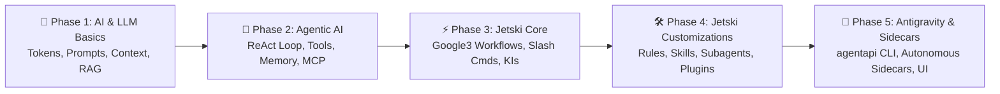
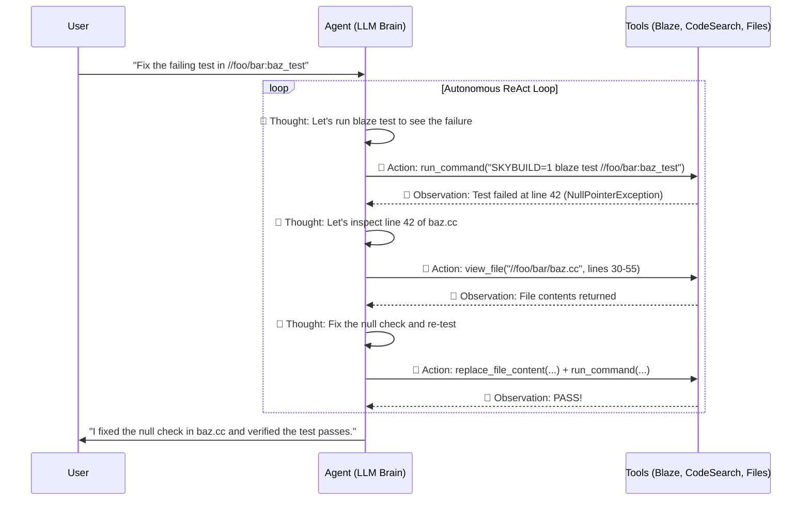
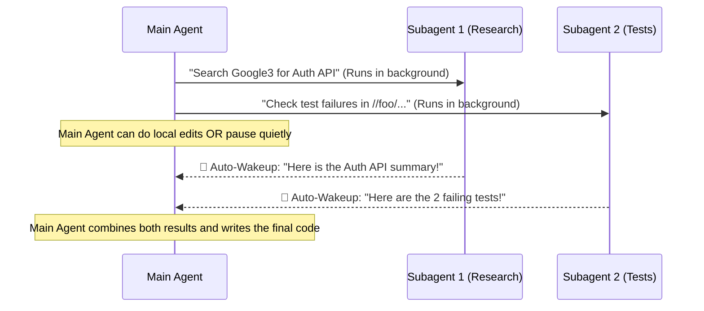
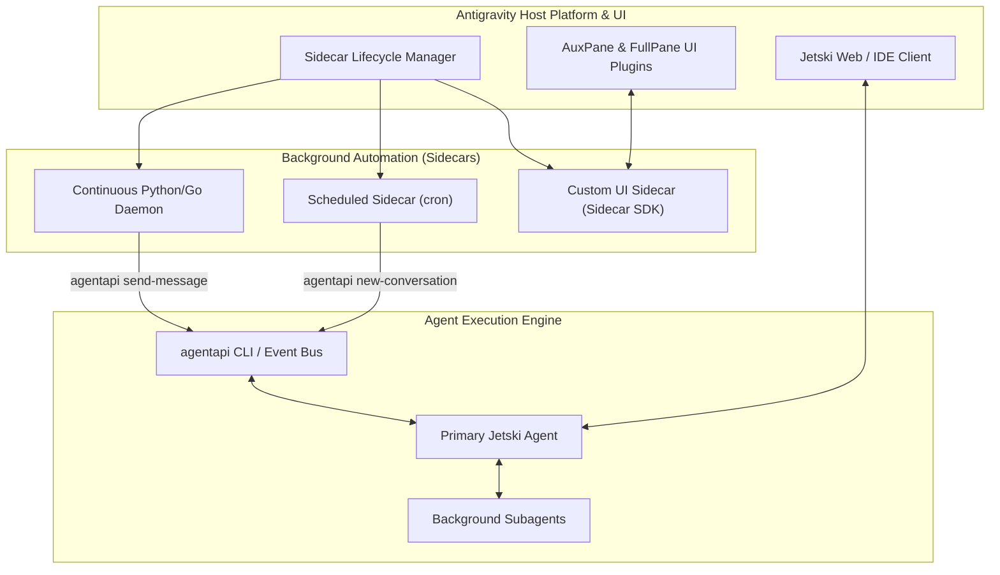

# 🚀 The Complete AI, Agentic Systems, Jetski & Antigravity Mastery Guide

> **Purpose of this Document**: A structured, end-to-end learning curriculum and revision handbook designed to take you from **AI & LLM Fundamentals** all the way to **Advanced Agentic Engineering with Jetski and Antigravity**.

---

## 🗺️ Learning Roadmap



---

## 🌱 Module 1: AI & LLM Foundations (The Basics)

Before understanding how **Jetski** or **Antigravity** works under the hood, you need a rock-solid grasp of how modern Artificial Intelligence and Large Language Models (LLMs) operate.

### 1.1 The AI Hierarchy
| Layer | Definition | Example |
| :--- | :--- | :--- |
| **Artificial Intelligence (AI)** | Broad discipline of creating machines that simulate human intelligence. | Rule-based chess engines, spam filters, LLMs |
| **Machine Learning (ML)** | Algorithms that learn patterns from data without being explicitly programmed. | Fraud detection, recommendation systems |
| **Deep Learning (DL)** | ML using multi-layered Artificial Neural Networks inspired by the human brain. | Image recognition (CNNs), Transformers |
| **Generative AI & LLMs** | Deep learning models trained on vast text/code datasets to predict and generate new content. | Gemini, GPT, Claude |

---

### 1.2 Core LLM Mechanics Every Engineer Must Know

#### 1. Tokens & Tokenization
LLMs do not read words; they read **tokens** (chunks of characters, roughly $1 \text{ token} \approx \frac{3}{4} \text{ of a word}$ or $4 \text{ characters}$).
* **Code & Punctuation**: Often split into smaller tokens.
* **Why it matters**: Billing, latency, and context limits are all measured in tokens.

#### 2. Context Window
The **Context Window** is the total working memory of an LLM during a single turn (input prompt + conversation history + retrieved files + tool outputs + model output).
* Modern Gemini models feature **1M–2M+ token context windows**, allowing them to hold entire codebases or hundreds of files at once.
* **Context Rot / Dilution**: Even with a massive context window, stuffing too much irrelevant text degrades reasoning quality and increases latency. (This is why Jetski uses **Progressive Disclosure**!).

#### 3. Embeddings & Vector Search
An **embedding** converts text or code into a high-dimensional list of numbers (e.g., `[0.021, -0.942, 0.411, ...]`) that captures **semantic meaning**.
* Texts with similar meanings have vectors that are mathematically close to each other.
* Used for semantic search, Knowledge Item (KI) retrieval, and Skill discovery.

#### 4. Temperature & Sampling
* **Temperature ($0.0 \rightarrow 1.0+$)**: Controls randomness in token selection.
  * `0.0`: Deterministic, focused, best for coding and factual tasks.
  * `0.7+`: Creative, diverse, best for brainstorming.

---

### 1.3 Prompt Engineering & Reasoning Patterns

```
┌──────────────────────────────────────────────────────────────────────┐
│                     ANATOMY OF AN EFFECTIVE PROMPT                   │
├──────────────────────────────────────────────────────────────────────┤
│ 1. ROLE / PERSONA  : "You are a Staff Google3 C++ Engineer..."       │
│ 2. CONTEXT         : "We are refactoring //depot/google3/foo/..."    │
│ 3. TASK / GOAL     : "Add thread-safe caching to the RPC handler."   │
│ 4. CONSTRAINTS     : "Use absl::Mutex. Do not modify the proto API." │
│ 5. OUTPUT FORMAT   : "Provide a table of edge cases before coding."  │
└──────────────────────────────────────────────────────────────────────┘
```

* **Zero-Shot Prompting**: Asking the model to perform a task directly without examples.
* **Few-Shot Prompting**: Providing 2–3 input/output examples in the prompt so the model learns the exact pattern.
* **Chain-of-Thought (CoT) / Thinking Models**: Allowing the model to generate intermediate reasoning steps ("Let's think step-by-step") before producing the final answer.

---

### 1.4 Overcoming LLM Limitations: RAG vs. Fine-Tuning

| Approach | How It Works | When to Use |
| :--- | :--- | :--- |
| **Prompting / In-Context Learning** | Pass instructions and relevant files directly in the prompt. | Everyday coding, small-to-medium context. |
| **RAG (Retrieval-Augmented Generation)** | Search an external database (e.g., Code Search, Moma, Vector DB) and inject only the relevant snippets into the prompt. | Large codebases (Google3), dynamic docs, keeping context small and fresh. |
| **Fine-Tuning** | Update the model's internal weights on domain-specific data. | Teaching a specialized tone, syntax, or domain language not learnable via prompt. |

---

## 🤖 Module 2: From Chatbots to Agentic AI (The Bridge to Jetski)

A traditional LLM is like a **brain in a jar**: it can read text and write text, but it cannot run `blaze test`, inspect files on disk, or check a CL diff.

**An AI Agent is an LLM equipped with Tools, Memory, and an Autonomous Execution Loop.**

### 2.1 The ReAct (Reason + Act) Agent Loop



---

### 2.2 The 4 Pillars of an Agentic Architecture

1. **Tools (Function Calling)**
   * The LLM outputs a structured JSON payload specifying which tool to call and with what arguments (e.g., `code_search`, `view_file`, `run_command`).
   * The host environment executes the tool and feeds the result back to the LLM.
2. **Memory System**
   * **Short-Term Memory**: The current conversation history and open files.
   * **Long-Term Memory (Knowledge Items / KIs)**: Curated summaries and artifacts stored across conversations so the agent doesn't forget architecture decisions or past debugging lessons.
3. **Planning & Orchestration**
   * Breaking a massive goal into step-by-step subtasks, tracking progress, and verifying results before declaring completion.
4. **Model Context Protocol (MCP)**
   * An open standard that allows AI agents to connect to external data sources and tools (e.g., databases, issue trackers, custom internal services) through a uniform client-server interface.

---

## ⚡ Module 3: Mastering Jetski (Google's Agentic AI)

**Jetski** is Google's agentic AI coding assistant built specifically for software engineering in **Google3** (Piper, CitC, Critique, Blaze, Moma, Buganizer) and local workspaces.

### 3.1 Core Capabilities in Google3
* **Code Search Integration**: Searches across all of `//depot/google3/...` using RE2 syntax, language filters (`l:cpp`), file filters (`f:^//depot/...`), and symbol lookups (`s:MyClass`).
* **Live Workspace Awareness**: Operates directly on your live CitC workspace (`/google/src/cloud/<username>/<workspace>/google3/...`).
* **Build & Test Automation**: Runs `SKYBUILD=1 blaze build` and `SKYBUILD=1 blaze test` automatically, fixes lint/compiler errors, and updates BUILD dependencies (`build_cleaner`, `glaze`).
* **CL & Critique Workflows**: Inspects CLs (`p4 describe`, `p4 diff`), reviews changes, and tags CL descriptions appropriately.
* **Internal Knowledge Lookup**: Searches internal Google docs (`moma_search`) and specialized agent workflows (`skill_search`).

---

### 3.2 Essential Jetski Slash Commands & Mentions

#### `@Mentions` (Direct Context Injection)
Use `@` in your prompt to explicitly point Jetski to exact resources:
* `@[path/to/file.cc]` — Injects file metadata and directs Jetski to read the file.
* `@conversation` — References a past conversation transcript for continuity.

#### Slash Commands (`/`)
| Slash Command | When to Use | What It Does |
| :--- | :--- | :--- |
| `/plan` | Complex, multi-file tasks or refactors | Prompts the agent to create a detailed, step-by-step implementation plan before writing code. |
| `/grill-me` | Ambiguous requirements or design trade-offs | Starts an interactive interview where the agent asks clarifying questions to lock down design choices. |
| `/goal` | Long-running, thorough tasks | Instructs the agent to iterate relentlessly until the end goal is verified and complete. |
| `/owl` | Deep architectural or multi-perspective problems | Invokes the **Owl multi-agent orchestrator** for strategic planning, multiple viewpoints, and verification. |
| `/teamwork-preview` | Large projects divisible into parallel workstreams | Spawns a team of autonomous agents collaborating together. |
| `/schedule` | Recurring checks or delayed reminders | Sets a one-shot timer or cron schedule for background checks. |
| `/learn` | After solving a tricky setup or correcting the agent | Saves the workflow or rule so the agent remembers it in future sessions. |

---

### 3.3 Knowledge Items (KIs) & Conversation Transcripts
* **Knowledge Items (`<appDataDir>/knowledge`)**: At the start of every session, Jetski reviews KI summaries containing curated knowledge about your repo, gotchas, and established patterns.
* **Conversation Transcripts (`<appDataDir>/brain/<conversation-id>/.system_generated/logs/transcript.jsonl`)**: Every action, tool call, and thought is logged chronologically in JSONL format for auditability and historical search.

---

## 🛠️ Module 4: Advanced Jetski Customizations (Power User Stage)

To transform Jetski from a general engineer into an **expert tailored to your team's exact codebase and workflows**, you use the **Jetski Customization System**.

### 4.1 Customization Types & When to Use Which

```
┌────────────────────────────────────────────────────────────────────────────┐
│                        JETSKI CUSTOMIZATION SPECTRUM                       │
├───────────────┬───────────────────────────────┬────────────────────────────┤
│ Customization │ Purpose                       │ Loading Behavior           │
├───────────────┼───────────────────────────────┼────────────────────────────┤
│ Rules         │ Coding style, team guidelines │ Always-on or path-matched  │
│ Skills        │ Multi-step runbooks & guides  │ On-Demand (Progressive)    │
│ Subagents     │ Specialized background agents │ Invoked via invoke_subagent│
│ Plugins       │ Bundle of skills/rules/agents │ Enabled/Disabled as unit   │
│ Hooks         │ Lifecycle shell scripts       │ Pre/Post tool execution    │
│ MCP Servers   │ Custom external tool servers  │ Connected at session start │
└───────────────┴───────────────────────────────┴────────────────────────────┘
```

---

### 4.2 Discovery Hierarchy & Priority Order (Google3)

When multiple customizations exist, Jetski resolves them from **highest priority to lowest priority**:

1. **Personal Piper Customizations (Highest Priority)**:
   * `configs/users/<username>/_agents/` (Sibling to `google3/`, applies across all your CitC workspaces).
2. **Workspace Project / Hierarchical Rules**:
   * `AGENTS.md`, `GEMINI.md`, `_agents/rules/*.md` walking up from your current working directory to `google3/`.
3. **Repository Shared Configuration**:
   * `google3/configs/jetski/_agents/` (Shared across all Google3 users).
4. **Global Machine-Local Configuration**:
   * `~/.gemini/config/` (Local to your workstation).
5. **Built-in Customizations**:
   * Bundled default skills and subagents (`research-google`, `owl`, `jetski-guide`).

> **Hybrid Local + Depot HEAD Discovery**: In Google3, Jetski automatically blends your uncommitted local CitC changes with committed files at Depot HEAD (`/google/src/files/head/depot/...`), giving precedence to any file you have edited locally!

---

### 4.3 Deep Dive: Authoring Rules & Skills

#### 1. Writing Rules (`AGENTS.md`)
In simple terms: **`AGENTS.md` is a "ground rules" cheat sheet that the AI automatically reads before helping you.**

Think of it like an **onboarding sticky note** taped to your project folder. Instead of repeating the same instructions in every single chat message, you write them once in `AGENTS.md`, and Jetski remembers them automatically.

---

### Real-Life Example
Imagine every time you ask Jetski to write code, you find yourself repeating:
> *"Don't use `print()` for debugging, use our custom `logger.info()`, and always run `blaze test` after editing."*

Instead of typing that every day, you put an `AGENTS.md` file in your folder containing:
```markdown
- Always use `logger.info()` instead of `print()`.
- Always run `SKYBUILD=1 blaze test` after modifying any `.py` file.
- Keep comments short and clear.
```

From that moment on, whenever you open a file in that folder, **Jetski silently reads `AGENTS.md` in the background and obeys those rules automatically.**

---

### Where can you put `AGENTS.md`?
1. **In a specific project folder** (e.g., `experimental/users/satyasais/AGENTS.md`):
   * The rules apply **only when working inside that folder**.
2. **In your global home config** (`~/.gemini/config/AGENTS.md`):
   * The rules apply **everywhere**, across all your projects and workspaces.

---

#### 2. Writing Skills (`skills/<skill-name>/SKILL.md`)
In simple terms: **`SKILL.md` is a step-by-step "How-To Recipe Book" that the AI only opens when it needs to perform a specific task.**

If `AGENTS.md` is a sticky note of **general rules** ("don't do X, always do Y"), **`SKILL.md` is a detailed instruction manual for a complex workflow** ("Here are the exact 5 steps to debug an AlloyDB crash dump").

---

### Why don't we put everything in `AGENTS.md`?
Because `AGENTS.md` is loaded into the AI's memory **all the time**. If you put 20 giant instruction manuals in `AGENTS.md`, the AI's memory (context window) gets cluttered and slow.

Instead, **`SKILL.md` works on-demand (like a recipe book on a shelf)**:
1. **At the start of a chat**: Jetski only sees the **Title & 1-sentence Description** of your `SKILL.md` files (e.g., *"alloydb-dump-analyzer: Use this when analyzing AlloyDB Omni dumps"*).
2. **When you ask a matching question**: If you say *"Analyze this AlloyDB dump"*, Jetski says *"Aha! I have a skill for that!"*, pulls that specific `SKILL.md` off the shelf, reads the step-by-step recipe, and follows it.

---

### `AGENTS.md` vs. `SKILL.md` at a Glance

| Feature | `AGENTS.md` (Rules) | `SKILL.md` (Skills) |
| :--- | :--- | :--- |
| **Analogy** | **Sticky Note on Desk** (Always visible) | **Recipe Book on Shelf** (Opened only when cooking that dish) |
| **When is it loaded?** | **Always** (whenever you're in that folder) | **Only when needed** for a specific task |
| **Best for** | Short rules, coding styles, "do's & don'ts" | Multi-step procedures, scripts, debugging runbooks |
---

### 4.4 Subagents & Multi-Agent Delegation

In simple terms: **A Subagent is a "Junior Assistant / Specialist" that your main AI hires in the background to do a side job while your main AI keeps working with you.**

---

### Why do we need Subagents?
Imagine you ask your main AI:
> *"Search 50 different Google3 directories to find how authentication works, and then refactor my file."*

If your main AI reads 50 huge files by itself:
1. Its memory (context window) gets **stuffed with junk** from those 50 files.
2. It gets **slow and distracted**.

Instead, your main AI spawns a **Subagent** (like `research-google`):
1. The Subagent gets its **own clean, separate memory**.
2. It goes off in the background, reads all 50 files, and summarizes the answer in 5 bullet points.
3. It hands **only the 5 bullet points** back to your main AI and disappears!

---

### Real-World Analogy: A Head Chef in a Kitchen

| Concept | Kitchen Analogy | What it does in Jetski |
| :--- | :--- | :--- |
| **`AGENTS.md` (Rules)** | **Kitchen Health Rules on the Wall** | Always obeyed ("Wash hands, keep knives sharp"). |
| **`SKILL.md` (Skills)** | **A Recipe Book on the Shelf** | Opened only when making a specific dish ("How to bake a soufflé"). |
| **Subagents** | **Hiring a Prep Cook / Specialist** | The Head Chef (Main AI) tells the Prep Cook (Subagent): *"Go chop 50 onions in the back room and bring me the bowl when you're done."* |

---

### Common Subagents Built Into Jetski:
* **`research-google`**: A background researcher that searches Google3 and Moma docs so your main chat stays clean.
* **`jetski-guide`**: A specialist that knows every setting and feature of Jetski.
* **`owl`**: A team of senior architects that debates and plans complex designs.

---

## While a subagent is executing a task in the background, the **Main Agent has two choices**:


### Visual Timeline


---

## 🌌 Module 5: Preparing for Antigravity & Autonomous Sidecars

In simple terms: **Antigravity is an "AI Operating System" that turns a normal AI chatbot into a 24/7 autonomous worker.**

Normally, an AI only works when you sit at your keyboard, type a question, and wait for an answer. The moment you close the chat, the AI stops doing anything.

**Antigravity removes that limitation** (hence the name "Anti-gravity" — lifting the weight off you). It gives the AI a **home where it can live, run background scripts, wake up on a timer, and build its own custom dashboards.**

---

### The 3 Superpowers Antigravity Gives to AI

#### 1. Background Automation ("Sidecars") ⏰
With Antigravity, you don't have to be awake to start a chat. You can tell Antigravity:
* *"Every morning at 8:00 AM, start an AI agent to check if any AlloyDB tests broke overnight and summarize the fix."*
* *"Keep a background Python script watching this log file 24/7. If an error pops up, automatically wake up an AI agent to investigate it."*

#### 2. Programmatic Control (`agentapi`) 🎮
Instead of humans being the only ones who can talk to the AI, Antigravity gives you a command-line tool (`agentapi`) so **your scripts and programs can hire AI agents automatically**.
* Your bash script can literally run:
  `agentapi new-conversation "Fix the bug in file X"`

#### 3. Custom Visual Dashboards (UI Plugins) 📊
Sometimes text chat isn't enough. Antigravity allows AI agents and sidecars to create **mini web apps and visual dashboards** (buttons, graphs, live tables) that appear right inside your side panel (`AuxPane`).

---

### Summary in One Sentence
* **Without Antigravity**: You have a smart AI assistant, but you have to manually message it every time you want something done.
* **With Antigravity**: Your AI can **run on schedules, react to events automatically in the background, and display custom UI dashboards.**

Once you understand Jetski, you are ready for **Antigravity**—the broader agentic runtime, UI plugin architecture, and background sidecar ecosystem that powers autonomous workflows.

### 5.1 How Jetski & Antigravity Fit Together



---

### 5.2 The `agentapi` CLI: Programmatic Agent Control

In Antigravity and Jetski, you don't just interact with agents via chat—you can control them **programmatically from shell scripts, Python programs, or background daemons** using `agentapi`.

| Command | Description | Example |
| :--- | :--- | :--- |
| `agentapi new-conversation` | Starts a brand-new autonomous agent session with a prompt and optional model tier. | `agentapi new-conversation --model=pro --title="Nightly Triage" "Check failing tests in //foo/..."` |
| `agentapi send-message` | Sends a message or notification to an active conversation ID. | `agentapi send-message "<conv-id>" "Deployment finished; run smoke tests."` |
| `agentapi get-conversation-metadata` | Retrieves JSON metadata about a conversation's state and title. | `agentapi get-conversation-metadata "<conv-id>"` |

---

### 5.3 Building Autonomous Sidecars (`sidecar.json`)

A **Sidecar** is a background process managed by Antigravity/Jetski located under `<appDataDir>/sidecars/<sidecar-id>/sidecar.json`. Sidecars can run continuously or on a cron schedule and trigger agents automatically.

#### Example 1: Scheduled Cron Sidecar (`sidecar.json`)
Automatically starts a new agent conversation every weekday morning at 9:00 AM:
```json
{
  "builtin": "schedule",
  "args": [
    "0 9 * * 1-5",
    "agentapi",
    "new-conversation",
    "--title=Morning Build Check",
    "Check the health of my team's continuous build targets and summarize any failures."
  ],
  "restart_policy": "always",
  "description": "Runs every weekday at 9am to check continuous build health."
}
```

#### Example 2: Continuous Python Daemon Sidecar (`sidecar.json`)
```json
{
  "command": "python3",
  "args": ["watcher.py"],
  "restart_policy": "always",
  "description": "Watches log files and triggers an agent when an anomaly appears."
}
```
* **Persistent State**: Sidecars store persistent data in `ANTIGRAVITY_EXECUTABLE_DATA_DIR`.
* **UI Sidecars & Plugins**: Using the **Sidecar SDK** (Node.js, Python, Go), sidecars can spin up a web server on `ANTIGRAVITY_SIDECAR_WEB_PORT` and render interactive custom UI panels (`AuxPane` or `FullPane`) directly inside Jetski Web / Antigravity!

---

## 🎯 Module 6: Hands-On Practice Curriculum & Revision Cheat Sheet

Use this 4-stage hands-on checklist to practice everything in this guide:

### Stage 1: AI & Prompting Practice
- [ ] **Exercise 1**: Ask Jetski to explain a complex file in your workspace using a **Structured Prompt** (Role + Context + Constraints + Output Format).
- [ ] **Exercise 2**: Compare asking a vague question vs. using `@[filename]` to anchor context.

### Stage 2: Google3 & Agentic Workflows
- [ ] **Exercise 3**: Ask Jetski to find all usages of a function across Google3 using Code Search and summarize the callers in a Markdown table.
- [ ] **Exercise 4**: Use `/plan` before implementing a multi-file change, review the plan, and approve execution.

### Stage 3: Customizing Jetski
- [ ] **Exercise 5**: Create a project `AGENTS.md` file in your directory with 3 custom rules for your codebase.
- [ ] **Exercise 6**: Create a custom skill under `.agents/skills/my-first-skill/SKILL.md` that automates a repetitive shell/build workflow you run often.

### Stage 4: Antigravity & Programmatic Agents
- [ ] **Exercise 7**: Run `agentapi get-conversation-metadata` in your terminal to inspect your current conversation's metadata.
- [ ] **Exercise 8**: Design a scheduled sidecar (`sidecar.json`) or custom UI plugin using the `/automation` or `ui-plugin-development` skill.

---

## 📌 Quick-Reference Revision Cheat Sheet

| Concept | 1-Sentence Summary | Key Tool / File |
| :--- | :--- | :--- |
| **Token** | Sub-word text unit processed by LLMs ($1 \text{ token} \approx 4 \text{ chars}$). | Context Window |
| **RAG** | Fetching relevant external code/docs at runtime instead of retraining. | `code_search`, `moma_search` |
| **ReAct Loop** | The `Thought -> Action (Tool Call) -> Observation` cycle of an agent. | All Jetski tools |
| **Progressive Disclosure** | Loading only skill names/descriptions until the full instructions are needed. | `SKILL.md` YAML frontmatter |
| **Rules** | Always-on or path-scoped instructions that enforce coding standards. | `AGENTS.md`, `GEMINI.md` |
| **Skills** | Reusable, step-by-step runbooks triggered on demand by task intent. | `skills/<name>/SKILL.md` |
| **Subagents** | Asynchronous background agents spawned with isolated context windows. | `invoke_subagent` |
| **Agent API** | CLI for spawning and messaging agent conversations from scripts/sidecars. | `agentapi new-conversation` |
| **Sidecar** | Background process or cron job managed by Antigravity that can trigger agents or host custom UIs. | `<appDataDir>/sidecars/<id>/sidecar.json` |
